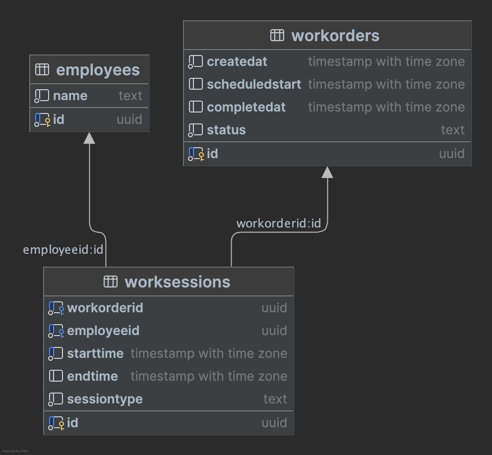
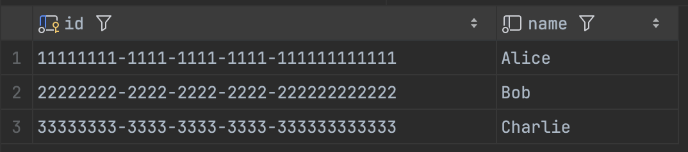
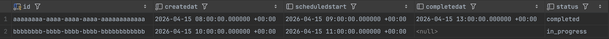
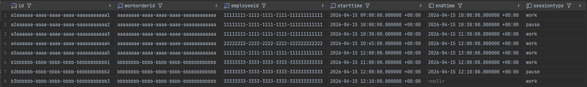

# ERP Work Order Time Modeling Assessment

## Overview

I approached this as a time-modeling problem, not just a status-tracking problem. The key question for me was: how do I make work time, pause time, and overall order duration easy to calculate in SQL without depending on application-side reconstruction later?

My answer was to model work as intervals. Instead of storing a single start and finish for a work order, I split execution into session rows that can represent active work or a pause. That decision is what makes the reporting logic straightforward.

This repository includes:

- `sql/schema.sql` for the schema
- `sql/metrics.sql` for the derived metrics view
- `sql/diagnostics.sql` for a simple query against the view
- `test/populateMockData.sql` for sample data
- `images/` for the ERD and sample table screenshots

## My Design Thinking

I did not start with the final shape. My first instinct was a much simpler model around employees and shifts, but that was not enough for the actual questions in the assessment. A shift can show that someone was on the clock, but it does not reliably show:

- which work order the time belonged to
- when work stopped versus resumed
- how much time was productive versus interrupted

Once I framed the problem around work-order analytics, the design became clearer. I needed the database to answer:

- How much active work happened?
- How much time was lost to pauses?
- How long did the order exist overall?
- How long was it in execution after real work began?

That pushed me to a three-table model:

- `employees`
- `workOrders`
- `workSessions`

The important design choice is in `workSessions`. Each row is a bounded interval tied to both an employee and a work order, and `sessionType` is constrained to either `'work'` or `'pause'`. I chose that because explicit pause rows are much easier to analyze than implied gaps.

## Functionality

### `employees`

I kept this intentionally small. It identifies who contributed time, and it supports multiple employees working on the same order.

### `workOrders`

This stores the order lifecycle:

- `createdAt`
- `scheduledStart`
- `completedAt`
- `status`

I included `scheduledStart` as planning data, but I do not use it in the core metrics. For cycle time, I care about when work actually began, not when it was expected to begin.

### `workSessions`

This is the core of the design. Each row stores:

- `workOrderId`
- `employeeId`
- `startTime`
- `endTime`
- `sessionType`

This table lets me represent start, pause, resume, and parallel work as separate intervals. It also includes the main integrity checks I thought were worth enforcing in the schema:

- foreign keys back to `workOrders` and `employees`
- a check that `endTime` must be later than `startTime` when present
- indexes on `workOrderId`, `employeeId`, and `startTime`

## How The Metrics Work

In `sql/metrics.sql`, I build a `workorder_metrics` view in a few steps:

1. Calculate each session's duration in seconds with `COALESCE(endTime, NOW()) - startTime`.
2. Aggregate work seconds and pause seconds by work order.
3. Find the first `'work'` session per work order.
4. Join those results back to `workOrders`.

That produces these fields:

- `actual_work_minutes`: sum of all `'work'` session durations for the order
- `pause_minutes`: sum of all `'pause'` session durations for the order
- `lead_time_minutes`: `completedAt - createdAt`
- `cycle_time_minutes`: `completedAt - firstWorkStart`
- `interruption_ratio`: `pauseSeconds / workSeconds`
- `efficiency`: `workSeconds / (workSeconds + pauseSeconds)`

I based cycle time on the first real work event, not `scheduledStart`, because I wanted execution metrics to come from execution data.

## Considerations And Tradeoffs

- I optimized for clarity over ERP completeness. The schema is small on purpose.
- Open sessions are treated as still running because the metrics view uses `COALESCE(endTime, NOW())`.
- In-progress work orders can accumulate work and pause minutes, but `lead_time_minutes` and `cycle_time_minutes` stay `NULL` until `completedAt` exists.
- Multiple employees can work the same order at the same time, so summed work minutes can exceed wall-clock elapsed time.
- The schema does not currently prevent overlapping sessions for the same employee or work order. I left that out to keep the model simpler.
- The schema uses `TIMESTAMP`, not `TIMESTAMPTZ`. The sample inserts include timezone-qualified literals, but timezone handling is not fully modeled at the column type level.

## Sample Data

I used `test/populateMockData.sql` to validate the main behaviors I cared about:

- completed work with a pause/resume sequence
- multiple employees contributing to one order
- an in-progress order with an open session

I used ChatGPT to speed up creation of the mock inserts, then checked that the sequences matched the schema and the reporting logic I wanted to test.

## Supporting Images

